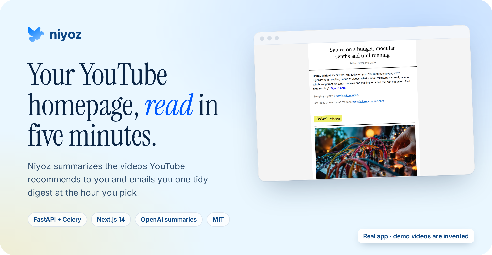
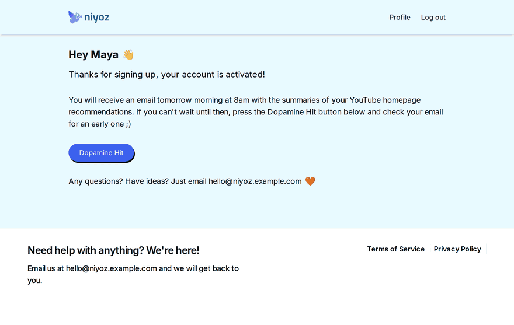
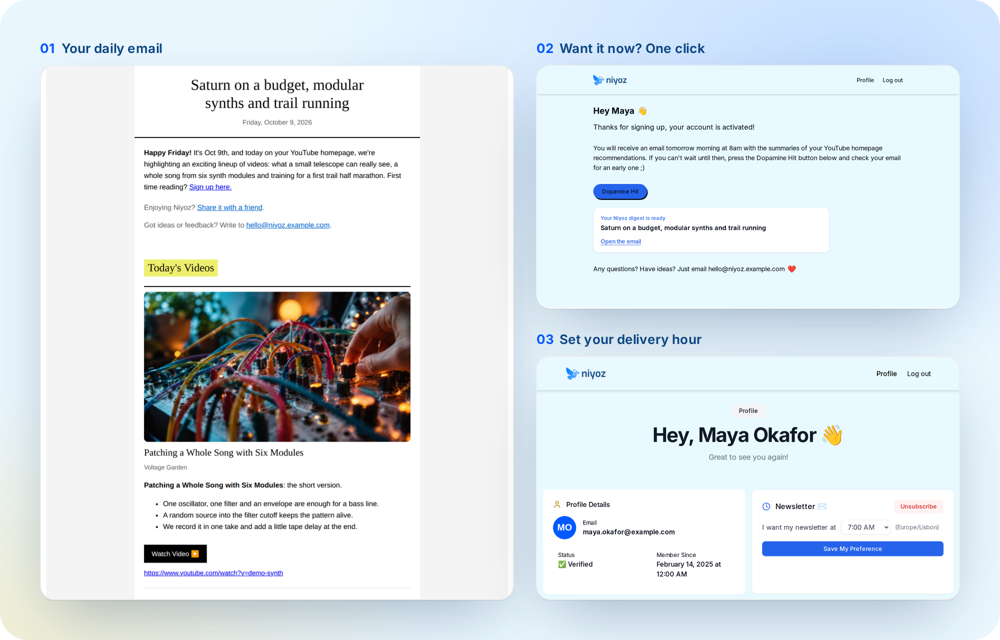
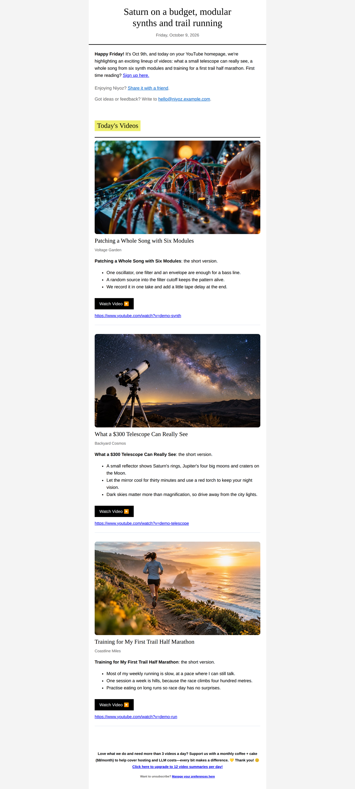
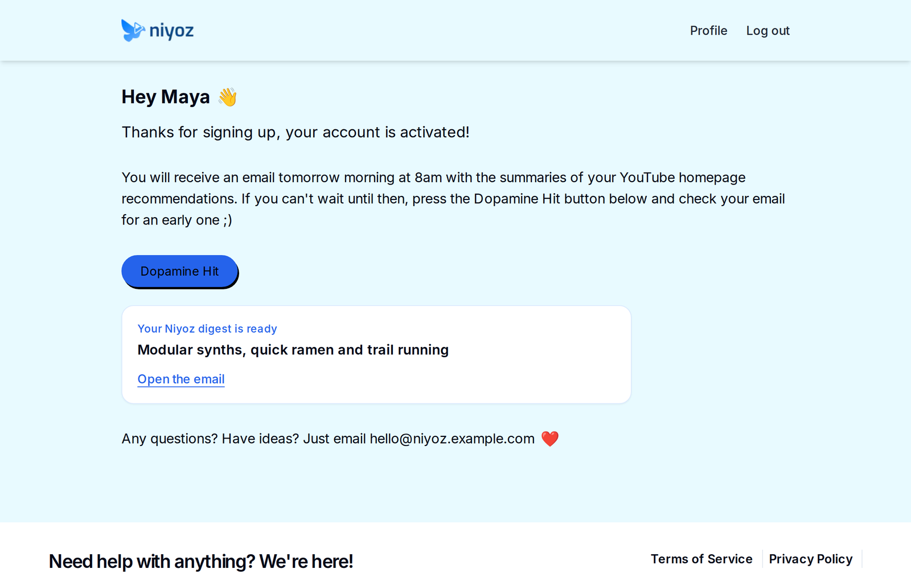
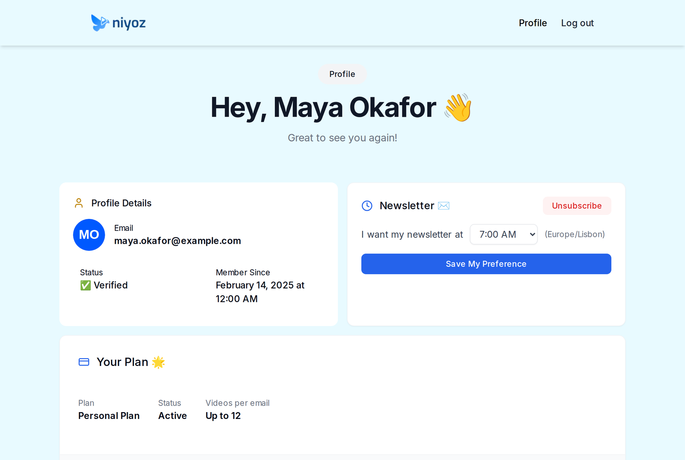
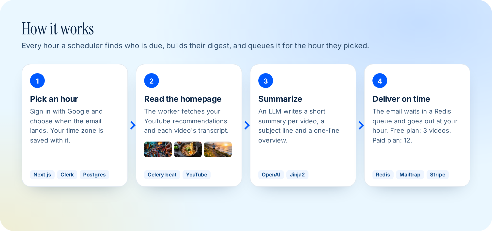

<div align="center">

<a href="#see-it-work">
  
</a>

<br>

**[Demo](#see-it-work)** ·
**[Features](#features)** ·
**[How it works](#how-it-works)** ·
**[Quick start](#quick-start)** ·
**[Configuration](#configuration)** ·
**[Landing page](docs/index.html)**

<br>

[](https://nextjs.org)
[](https://fastapi.tiangolo.com)
[](https://docs.celeryq.dev)
[](LICENSE)

</div>

Niyoz reads the videos YouTube recommends to you, summarises each one, and emails you a single digest at the hour you choose. You get the gist of your homepage in about five minutes, and you only open the videos that are worth the time.

This repo has the whole product: the Python worker that builds and sends the emails (`core/`) and the Next.js site where people sign in, pick an hour and manage their plan (`web/`).

## See it work

<div align="center">
  
  <br>
  <sub>The real app running locally in demo mode, recorded headless with Playwright. The user, the channels and the videos are invented.</sub>
</div>

<br>

<div align="center">
  
</div>

## Features

### One email a day, at your hour

Each digest has a subject line and a one-line overview written for that day's videos. Then every video gets its thumbnail, title, channel, a short summary with three bullet points, and a Watch button. Free users get 3 videos a day and paid users get 12.



### Want it now? Press Dopamine Hit

After sign-up, the dashboard tells you when your first email arrives. If you can't wait, **Dopamine Hit** builds a digest straight away and sends it.



### Pick your hour and your plan

Sign in with Google, then choose the hour the email lands. Your time zone is saved with it. The profile page also shows your plan and has an unsubscribe button. Payments and the customer portal run on Stripe.



## How it works

<div align="center">
  
</div>

- **Schedule.** Celery beat runs every hour. It calls a Postgres function to find the users whose chosen hour falls in the next window.
- **Read.** For each user the worker gets their Google token from Clerk (YouTube read-only scope) and reads the homepage feed. `youtube-transcript-api` fetches each transcript. Videos without a transcript are skipped.
- **Summarise.** OpenAI writes a summary per video, plus the subject line and the overview. The email is rendered from `core/templates/newsletter.html`.
- **Deliver.** The finished email waits in a Redis sorted set keyed by send time. A second task runs every minute and sends the due emails through Mailtrap.

`POST /send-newsletter` (with an `X-API-Key` header) skips the queue and builds one digest straight away. The Dopamine Hit button calls it.

## Quick start

The fastest way to see Niyoz is demo mode. It needs no Google, OpenAI, Clerk, Stripe or Postgres account. YouTube is replaced by eight invented videos, and emails are written to a local folder instead of being sent.

You need Python 3.12 with [Poetry](https://python-poetry.org), Node.js 20 and Docker (for Redis).

```bash
git clone https://github.com/enzihub/niyoz.git
cd niyoz
docker run -d --name niyoz-redis -p 6379:6379 redis:alpine
```

**Backend** on http://127.0.0.1:8000:

```bash
cd core
poetry install
YOUTUBE_DEMO_MODE=true REDIS_URL=redis://127.0.0.1:6379/0 API_KEY=dev \
DEMO_THUMB_BASE_URL=http://127.0.0.1:8000/demo/thumbs \
poetry run uvicorn main:app --port 8000
```

**Web app** on http://127.0.0.1:3000, in a second terminal:

```bash
cd web
npm install
NEXT_PUBLIC_DEMO_MODE=true NIYOZ_DEV_API_URL=http://127.0.0.1:8000 NIYOZ_DEV_API_KEY=dev \
npm run dev
```

Open http://127.0.0.1:3000/dashboard and press **Dopamine Hit**. The email it builds is at http://127.0.0.1:8000/demo/outbox/latest. Without `OPENAI_API_KEY` the summaries are canned text. With a key, the real prompts run on the invented transcripts.

Run the backend tests with `cd core && poetry run pytest`.

For a real setup, copy `core/.env.example` to `core/.env.development` and `web/.env.example` to `web/.env.local`, and fill in the blanks. Then run the Celery worker and beat as shown in [core/README.md](core/README.md), or start everything with `docker compose up --build` in `core/`. The database schema is in `web/src/db/migrations`.

## Configuration

Every value in both `.env.example` files is blank on purpose.

| Variable | App | What it does |
| --- | --- | --- |
| `API_KEY` / `NIYOZ_DEV_API_KEY` | core / web | Shared secret the web app sends as `X-API-Key` |
| `NIYOZ_DEV_API_URL` | web | Where the core API runs |
| `DATABASE_URL` | both | Postgres, shared by both apps |
| `REDIS_URL`, `CELERY_BROKER_URL`, `CELERY_RESULT_BACKEND` | core | Email queue and Celery broker |
| `CLERK_SECRET_KEY`, `NEXT_PUBLIC_CLERK_PUBLISHABLE_KEY`, `SIGNING_SECRET` | both | Google sign-in with the YouTube read-only scope |
| `OPENAI_API_KEY` | core | Summaries, subject lines and overviews (`GEMINI_API_KEY` is optional) |
| `MAILTRAP_API_TOKEN`, `FROM_EMAIL`, `FROM_NAME` | core | Email delivery |
| `SCRAPEOPS_API_KEY` | core | Optional proxy for transcript fetching |
| `STRIPE_SECRET_KEY`, `STRIPE_WEBHOOK_SECRET`, `NEXT_PUBLIC_STRIPE_*` | web | Paid plan, checkout and customer portal |
| `APP_URL`, `CONTACT_EMAIL`, `NEWSLETTER_LOGO_URL` | core | Links and branding inside the email |
| `NEXT_PUBLIC_AUTHORIZED_EMAILS` | web | Emails that see an extra "send now" button on the profile page |
| `NEXT_PUBLIC_GA_ID`, `NEXT_PUBLIC_GTM_ID` | web | Optional analytics, off when blank |
| `SENTRY_DSN` | core | Optional error tracking |
| `YOUTUBE_DEMO_MODE`, `NEXT_PUBLIC_DEMO_MODE` | core / web | Invented videos and an invented user, no outside accounts |

## Repository layout

```
core/     FastAPI + Celery worker: YouTube, transcripts, summaries, email queue
web/      Next.js 14 site: sign-in, dashboard, profile, pricing, Stripe webhooks
docs/     Self-contained landing page (docs/index.html), images and fonts
assets/   README images and the HTML they are rendered from (assets/source)
```

## Status

Built by Enzi Studio in 2025 and shared as-is. For this release we removed private settings and internal tooling, and we added demo mode so the app runs without any outside accounts. Issues and pull requests are welcome, but we don't plan new features.

Niyoz uses YouTube data through a user's own Google sign-in. If you run it for other people, follow the [YouTube API Services Terms](https://developers.google.com/youtube/terms/api-services-terms-of-service). The thumbnails in `docs/demo-thumbs/` are AI-generated scenes for the invented demo videos. No real creator's image is used.

## Credits

Built by [Enzi Studio](https://github.com/enzihub). Contributors to the original repositories: [@RukshanJS](https://github.com/RukshanJS), [@sun2ii](https://github.com/sun2ii), [@bb-xops](https://github.com/bb-xops), [@harrythentrepreneur](https://github.com/harrythentrepreneur), [@kavishkanimsara](https://github.com/kavishkanimsara) and [@ZainAli104](https://github.com/ZainAli104).

Fonts: [Inter](https://rsms.me/inter/) and [Instrument Serif](https://github.com/Instrument/instrument-serif), both under the SIL Open Font License.

## Licence

[MIT](LICENSE). Copyright (c) 2025-2026 Enzi Studio (Harry Edwards).
